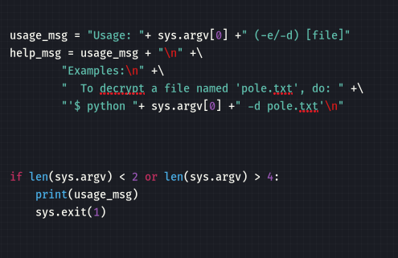
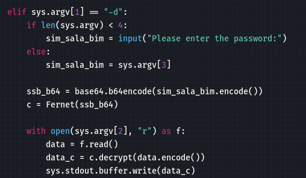
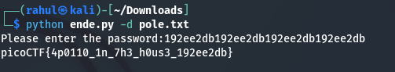

# Python Wrangling picoCTF 2021 (10 pts)

We are given a python script [ende](files/ende.py)

A text file [pw](files/pw.txt) which contains the password
```
192ee2db192ee2db192ee2db192ee2db
```
and an EN file [flag.txt](files/flag.txt.en) which contains the encoded flag.
```
gAAAAABgUAIVX7N_dNxY0j5lWtsDEN2b-h0mN-Lyhm_9QaEdwFK4em1kGiAV52ewbKv8wZJL2QwecZ7kTsVQ11PYEL3BJLD4LVyKrCKAvTFu5-1yuNGFAXKBY8GO3nIReXuOUbaSwVHl
```

In the given python script, we can see that the script is built to interact with a file called "pole.txt" and it supports two arguments (-e/-d)


and we can also see that if we supply “-d” to the command, the program will check if there are less than 4 arguments (arg). To explain this a little more: ende.py is arg[0], the “-d” is arg[1], and “pole.txt” is arg[2]. So when we run the program we will meet this requirement and it will ask for a password, which we have in the “pw.txt” file.



Now, we can run the 
```
cp flag.txt.en pole.txt
```
to copy the flag.txt.en file and rename it to pole.txt


Now we run the script as
```
python ende.py -d pole.txt
```


We got the flag!!
