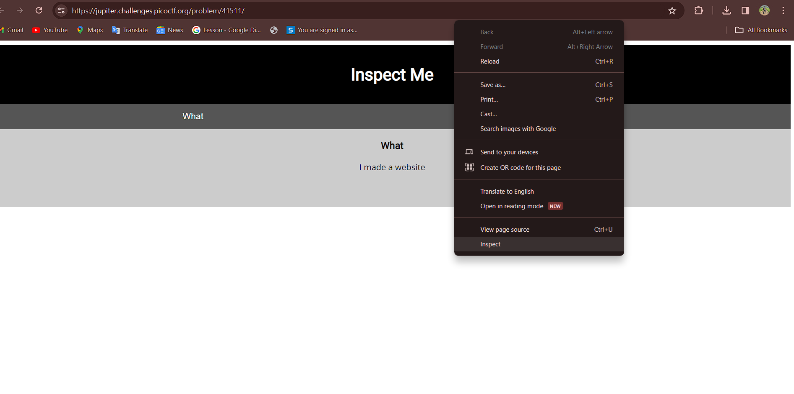
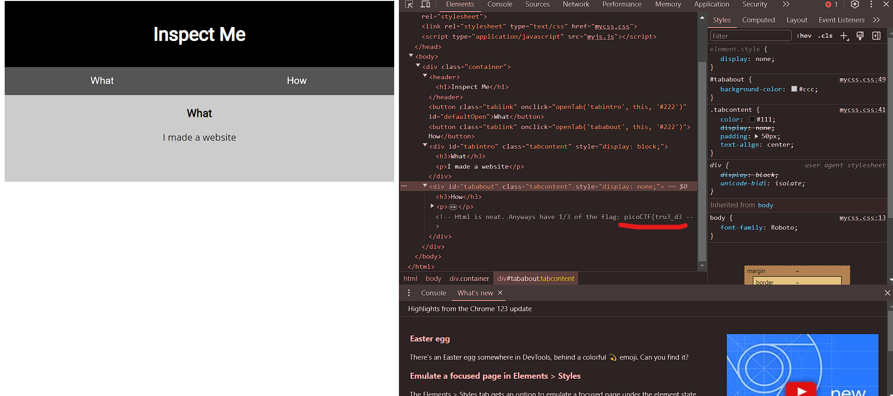
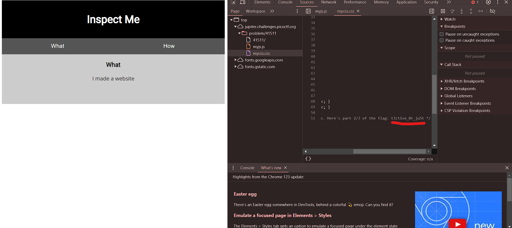
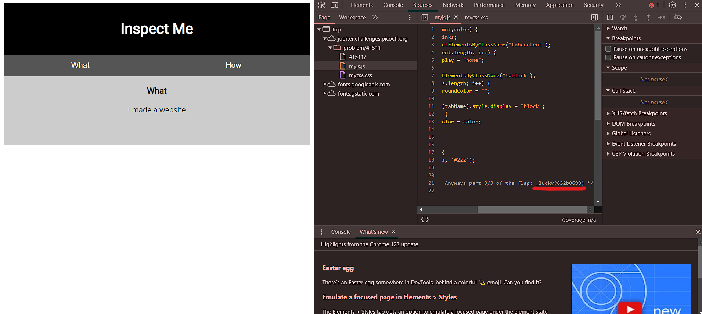

# Insp3ct0r picoCTF 2019 (50 pts)

In this question, we are given with a [link](https://jupiter.challenges.picoctf.org/problem/41511/). 

After clicking on the link we will be shown a web page which says 'Inspect Me'.

So to inspect the site, right click anywhere on the web page and choose ```Inspect```.




In the ```Elements``` section, we can see the first part of our flag as shown 




### Now, let us check the ```Css``` and ```JavaScript``` Source code too!

Click on the ```Sources``` section present in the top side of the inspect tab.

There you can see a file named ```mycss.css``` and ```myjs.js```.

Let us visit the ```mycss.css```.

Here we can see from the image, we have found the part 2 of the flag!!



Now for the third part of the flag, let us check the ```myjs.js``` file.

We have found the part 3 of the flag!!



The final flag is:
```
picoCTF{tru3_d3t3ct1ve_0r_ju5t_lucky?832b0699}
```


